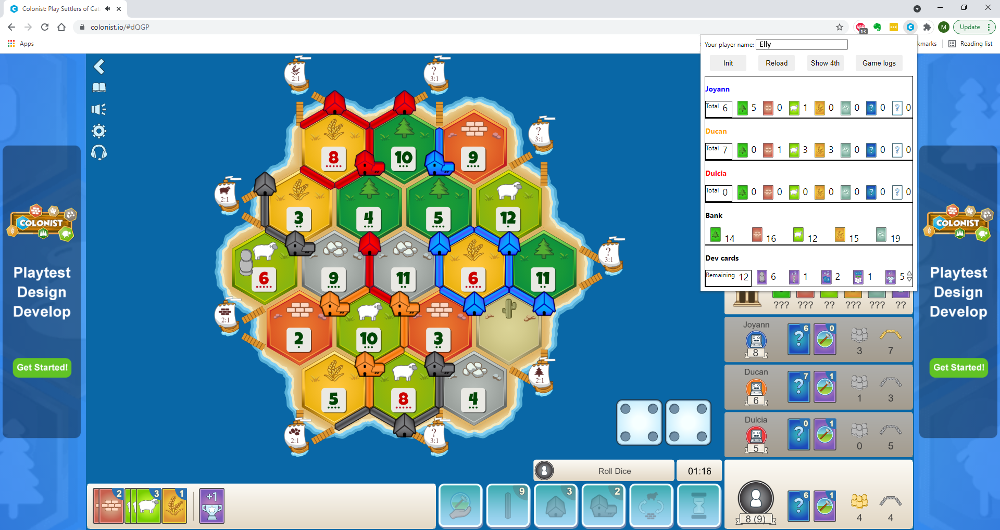

# Catan Counting Tool
This counting tool helps to reveal the number of resource cards that all players have in their hand, including bank cards while you are playing Catan at [Colonist.io](https://colonist.io). It is extremely useful when 'Private Bank Card' is set and you have a Monopoly card in your hand :smiling_imp:.

****Screenshot****

## Usage
* Download the source code.
* Install the extension in Chrome (load unpacked, see [Chrome extension - Getting started](https://developer.chrome.com/docs/extensions/mv3/getstarted/#manifest)).
* Go to a game with other players.
* Open the extension and enter your player name into 'Your player name' input box (only need to do for the first time).
* Click 'Reload', the extension will show all players' cards in its popup window.
* Open the extension at any time and click 'Reload' again to fetch for latest update (the extension does not poll for resource changes).
* If you go for another game, click 'Init' to reset all the countings.
* If you're spectating another game:
  * Enter the name of the last player in 'Your player name' box.
  * Click 'Show 4th' to show 4th player's cards.

## Feature
* Track resource cards in your opponents' hands. Events that resources are involved include:
  * Receiving starting resources
  * Throwing dice
  * Building settlement
  * Building road
  * Building city
  * Buying dev card
  * Trading (with player or bank)
  * Robbing
  * Discarding (by rolling 7)
  * Using dev card (Year of Plenty, Monopoly, ...)
* Track dev cards that has been used and number of remaining cards.

## Limitation
* At the moment, it only works with games of 4 players.
* It only works if you aren't disconnected from the game for any moment (see 'How it works').
* It cannot count the number of 'Victory Point' cards in your hand (as well as your opponents), so use the manual up/down button to update the count if you know a VP has been bought.
* When a player uses 'Monopoly', card counting is incorrect if any of the player having 'myth' cards, cards that stole from (or be stolen by) other players (not you).
* If the 'Reload' button just doesn't work, click 'Init' then click 'Reload' again.

## How it works
* The tool reads a list of game logs from the web page while you're playing and do the counting base on that. Therefore, it is impossible to do the correct counting if any log is missing (when you are disconnected).

## Report issue
Do these steps when something is wrong to report an issue:
* Right click in the plug-in popup window and select 'Inspect'.
* Navigate to 'Console' tab from the opened DevTools window.
* Clear existing logs.
* Switch back to the tool and click 'Game log' button.
* Copy all the game logs from DevTools' console and include them in the issue's description.

Contribution are welcome.

GLHF,
Max
